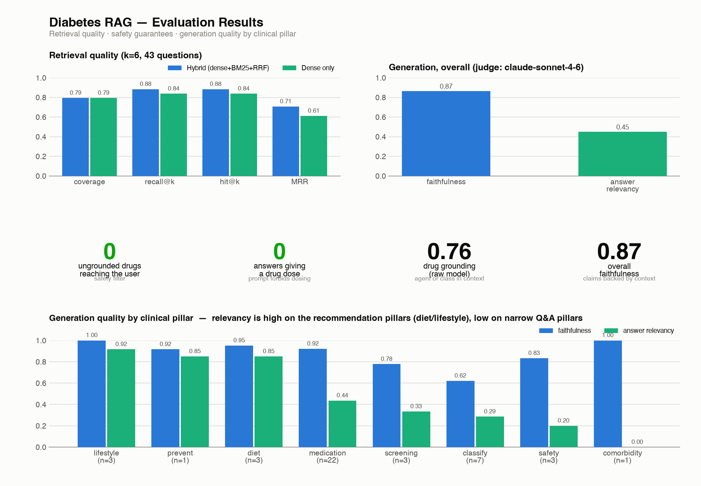

# Diabetes Prediction + RAG Recommendations

Predicts a person's diabetes stage (No Diabetes / Pre-Diabetes / Type 2) with an
XGBoost model from a web form, then generates **personalized, guideline-grounded
health recommendations** with a RAG pipeline over 13 ADA (American Diabetes
Association) clinical guideline PDFs — with safety guardrails at every step.



## Try it (Docker)

```bash
git clone https://github.com/WilliamNguyen1908/diabetes-prediction-rag
cd diabetes-prediction-rag
docker compose up -d --build
docker compose exec ollama ollama pull llama3.1   # one-time, ~4.7 GB
```

Open **http://localhost:8000** — fill in the form, get a prediction, answer the
comorbidity questions, get recommendations with cited sources. Everything runs
locally; no patient data leaves the machine.

> First `/recommend` call loads the models (~30 s); after that it's llama3.1
> inference (~1–2 min on CPU). To generate with Claude instead (better quality,
> but the patient profile goes to the Anthropic API), set
> `GENERATOR_MODEL=claude-sonnet-4-6` + `ANTHROPIC_API_KEY` in `docker-compose.yml`.

## How the RAG pipeline works — and what we chose at each step

Every stage below was a deliberate choice over a more common default, usually
after trying the default and watching it fail. Full history in
[workflow.md](workflow.md) and [CLAUDE.md](CLAUDE.md).

| Stage | What this project does | Instead of | Why |
|---|---|---|---|
| **PDF extraction** | `pymupdf4llm` (layout-aware) | markitdown / pdfminer | The ADA journal PDFs are multi-column; pdfminer interleaved the columns into garbage (0 headings recovered vs 52). |
| **Chunking** | **Semantic chunking**: split on Markdown headings, keep the `H1 > H2 > H3` trail on every chunk, split oversized sections at sentence-embedding breakpoints | Fixed-size windows | Fixed windows cut a clinical threshold from its condition mid-sentence — unsafe for medical text. Tables are never split. |
| **Indexing** | Brute-force cosine over a NumPy matrix | FAISS / vector DB | ~1,300 chunks: a matrix dot product is instant. Right-sizing beats infrastructure; the swap point is isolated in `rag/store.py`. |
| **Query transformation** | **Stage-aware query decomposition**: prevention/screening queries for low-risk patients, treatment queries for Type 2, plus one medication query *per comorbidity* | One blind query from the form | The naive splice produced junk like "No Diabetes diabetes" and pulled treatment chunks for healthy patients. |
| **Retrieval** | **Hybrid: dense (bi-encoder) + BM25, fused with Reciprocal Rank Fusion** | Dense-only | Embeddings under-weight exact tokens; drug names (`empagliflozin`, `SGLT2`, `finerenone`) need lexical match. Hybrid beats dense on recall (0.88 vs 0.84) and MRR (0.71 vs 0.61), biggest gap on medication questions. |
| **Corrective retrieval** | If a comorbidity has no supporting chunk, an LLM rewrites the query and retries (CRAG-style) | Accepting the first miss | A patient's heart-failure guidance shouldn't silently vanish because one query phrasing missed. |
| **Re-ranking** | **Cross-encoder** (`bge-reranker-base`) rescores the merged candidate pool → top 12 | Trusting RRF order | Retrieve-then-rerank: the bi-encoder casts a wide net fast; the cross-encoder reads query+chunk together for precise final ordering. |
| **Generation** | Grounded prompt: context-only answers with `[n]` citations, personalized to the patient's own values, **llama3.1 local by default / Claude opt-in** | Cloud-only | Privacy: the patient profile is in the prompt. The A/B eval says Claude is clearly better (relevancy 0.81 vs 0.51) — that trade-off is documented, measured, and left to the operator. |
| **Guardrails** | Input consistency validation (400 on contradictions), **deterministic drug-name redaction** (a drug not present in the retrieved context never reaches the user), NLI entailment tripwire per claim, output structure checks | Trusting the LLM | The model *did* invent drug names when the context lacked medications — observed, then made impossible by construction, not by prompt-begging. |
| **Audit** | Every request logged to SQLite: patient profile, formed queries, retrieved chunks | Black-box responses | Reproducibility and review — you can reconstruct exactly why any recommendation was made. |

## Evaluation

Measured, not vibes — 43-question gold testset with reference contexts,
embedding-based retrieval metrics cross-validated by an LLM judge:

| Metric | Result |
|---|---|
| Retrieval recall@6 / MRR (hybrid) | **0.88 / 0.71** (dense-only: 0.84 / 0.61) |
| Retrieval recall, LLM-judged | 0.82 (cross-validates the embedding number) |
| Faithfulness (Claude judge) | 0.87 overall |
| Ungrounded drugs reaching the user | **0** (deterministic filter) |
| Answers containing a drug dose | **0** (forbidden by design) |
| Generator A/B (Claude vs llama3.1) | faithfulness 0.99 vs 0.88 · relevancy 0.81 vs 0.51 |

Reproduce: `uv run python rag/eval/retrieval_eval.py`, `judge_direct.py`,
`compare_generators.py` (the judged ones need `ANTHROPIC_API_KEY`). Figure:
`rag/eval/result.py` → `results.png`.

## Prediction model

XGBoost multiclass on 28 form fields (demographics, vitals, lipids, glucose
panel, lifestyle), trained on a deliberately messy 100k-row dataset
(`diabetes.csv`) — cleaning, leakage exclusions (`diabetes_risk_score`,
diagnosis-derived columns), and preprocessing live in one bundle
(`preprocess_bundle.joblib`) so training and live inference share identical
transforms.

## Run locally (development)

```bash
uv sync                                # Python 3.14 + all deps
uv run uvicorn app:app --reload        # needs Ollama running with llama3.1
```

Rebuild the vector index only when the PDFs change:
`uv run python rag/convert.py && uv run python rag/ingest.py`

## Repo map

| Path | What |
|---|---|
| `app.py` | FastAPI app: form UI, `POST /predict`, `POST /recommend` |
| `predict.py` | XGBoost inference (`diabetes_xgb.json` + `preprocess_bundle.joblib`) |
| `rag/convert.py` → `chunk.py` → `embed.py` → `ingest.py` → `store.py` | Build-time: PDFs → Markdown → semantic chunks → embeddings → index |
| `rag/retrieve.py` | Hybrid retrieval (dense + BM25 + RRF) + cross-encoder reranker |
| `rag/generate.py` | Query decomposition, retrieval orchestration, grounded generation, drug-safety filter |
| `rag/validation.py`, `rag/grounding.py` | Input/output guardrails, NLI grounding check |
| `rag/eval/` | Evaluation suite: retrieval metrics, LLM-as-judge, generator A/B |
| `db.py` | SQLite audit log of every recommendation request |
| `CLAUDE.md` / `workflow.md` | Full architecture docs: pipeline map, design history, function reference |

## Disclaimer

Educational project. Not medical advice; predictions and recommendations are
not a substitute for clinical judgment.
